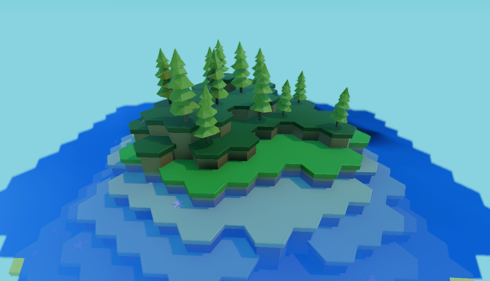

# Godot 3D Hexagon World Editor

A small project for generating and editing hexagon worlds. Inspired by https://www.reddit.com/r/blender/comments/butgsi/tried_mixing_a_lowpoly_style_with_a_hexagon/

## Camera controls
W/A/S/D/Q/E: Move camera \
Right click + drag: Rotate camera \
Scroll: Change camera speed

## Modification operations
There are four modes that can be switched between using the left and right arrow key. Increase/decrease the selection area with the up and down arrow keys. These modes are:

### View mode
A mode without any selection highlight. Use for viewing the scene.

### Terrain mode
A mode for editing the terrain height.

**Controls:** \
Left click: Raise terrain \
Left click + shift: Lower terrain \
Middle click: Select terrain height \
Left click + control: Change terrain height towards the selected terrain height

### Biome mode
A mode for changing the biome.

**Controls:** \
Left click: Change to the next biome \
Left click + shift: Change to the previous biome \
Middle click: Select biome \
Left click + control: Set the biome to the selected biome

### Decoration mode
A mode for toggling and regenerating the decoration for the selected hexagons. Decorations are for example stones and trees.

**Controls:** \
Left click: Add decoration \
Left click + shift: Remove decoration \